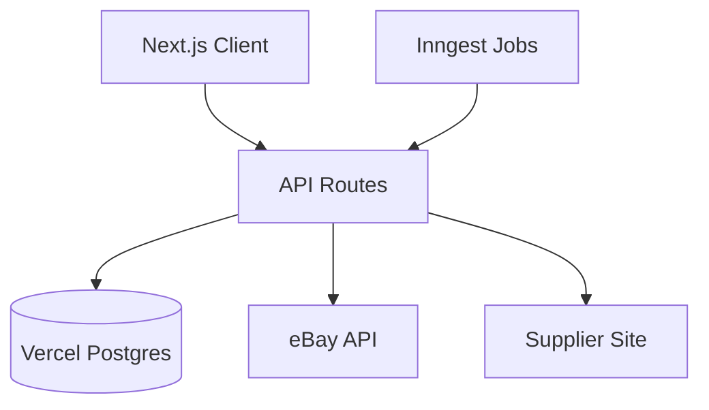

# SellerSync

eBayと仕入先の商品情報を同期・管理するシステム

## 概要

SellerSyncは、以下の機能を提供します：

- eBayの商品情報の取得・更新
- 仕入先からの商品情報のスクレイピング
- 在庫の自動同期
- 利益率を元にした価格の自動同期
- 為替レートの自動更新

## システム構成

### 使用技術

- フロントエンド

  - Next.js 15.1.3
  - TypeScript 5.7.2
  - NextUI 2.6.10
  - Zustand (状態管理)

- バックエンド

  - Next.js API Routes
  - Vercel Postgres
  - Inngest (バッチ処理)

- 認証
  - Auth0

### アーキテクチャ



## データベース設計

[データベース設計書へのリンク](docs/database.md)

## API仕様

### eBay API

- GET `/api/ebay/import-all` - 全商品情報の取得
- POST `/api/ebay/revise` - 商品情報の更新

### スクレイピングAPI

- GET `/api/supplier/scrape-all` - 全商品の価格・在庫取得
- GET `/api/supplier/scrape-all?error=true` - エラー商品の再取得

### 為替API

- GET `/api/exchange/update` - 為替レートの更新

## バッチ処理スケジュール

| ジョブ               | スケジュール | 内容                         |
| -------------------- | ------------ | ---------------------------- |
| eBay商品同期         | 6時間おき    | 全商品情報の取得             |
| 仕入先スクレイピング | 6時間おき    | 価格・在庫情報の更新         |
| エラー商品再取得     | 6時間おき    | エラーが発生した商品の再取得 |
| 為替レート更新       | 12時間おき   | USD/JPYレートの更新          |

## 開発環境のセットアップ

1. 必要な環境変数

```bash
# .env.local
DATABASE_URL=
AUTH0_SECRET=
AUTH0_BASE_URL=
AUTH0_ISSUER_BASE_URL=
AUTH0_CLIENT_ID=
AUTH0_CLIENT_SECRET=
EBAY_APP_ID=
EBAY_CERT_ID=
EBAY_DEV_ID=
EBAY_RU_NAME=
```

2. 依存関係のインストール

```bash
yarn install
```

3. 開発サーバーの起動

```bash
yarn dev
```

## デプロイ

1. Vercelへのデプロイ
2. 環境変数の設定
3. Vercel Postgresの設定
4. Inngestの設定
5. Auth0の設定

